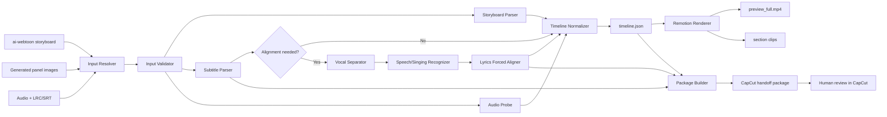

# 시스템 설계

## 1. 목적과 사용자 결과

### 해결하려는 문제

곡마다 이미지 개수, 음악 길이, 섹션 수, 자막 타임코드가 달라 수동으로 이미지 길이와 자막을 맞추는 작업이 반복된다. 특히 Suno Remix, Extend, 장르 변형 이후에는 기존 LRC/SRT가 실제 보컬과 어긋날 수 있다.

### 사용자가 얻는 결과

- 음악 길이와 정확히 일치하는 `timeline.json`
- Remotion 전체 미리보기 MP4
- 필요 시 Intro, Verse, Chorus 등 섹션별 MP4
- 최종 음원 기준으로 보정된 `lyrics_aligned.srt`
- 자막 신뢰도와 수동 검수 구간이 표시된 보고서
- CapCut에 가져오기 쉬운 정리된 전달 폴더

### 성공 조건

1. 이미지 수와 음악 길이가 달라도 타임라인 전체 길이가 음악과 일치한다.
2. 이미지가 부족하거나 과다할 때 정의된 정책으로 처리하고 경고를 남긴다.
3. LRC/SRT가 어긋난 경우 재정렬 결과와 신뢰도를 출력한다.
4. 최종 영상과 자막을 사람이 재검수할 수 있다.
5. 모든 생성 파일은 곡별 작업 폴더에 저장되고 원본은 변경하지 않는다.

## 2. 범위

### MVP

- Windows 11 로컬 CLI
- 한 곡 단위 처리
- MP3/WAV/M4A/FLAC 길이 측정
- `01_storyboard.md` 파싱
- `panel_NNN_*` 이미지 탐색 및 정렬
- LRC/SRT 파싱
- 음악 길이 기반 타임라인 정규화
- Remotion 전체 영상 렌더링
- SRT와 검수 보고서 출력
- CapCut 수동 가져오기용 전달 폴더 생성

### Phase 2

- Demucs 계열 보컬 분리
- WhisperX 계열 초벌 인식과 단어 시간 추정
- 원본 가사와 인식 결과의 강제 정렬
- 반복·생략·애드리브 탐지
- 저신뢰 구간 전용 검수 UI 또는 HTML 보고서
- 섹션별 MP4 출력

### Phase 3

- 여러 곡 일괄 처리
- GPU 사용 선택
- CapCut 초안 생성 실험
- 프리셋 기반 16:9, 9:16 동시 렌더링
- 품질 통계와 회귀 샘플 관리

## 3. 시스템 구조



## 4. 역할 경계

| 구성요소 | 책임 | 하지 않는 일 |
|---|---|---|
| Input Resolver | 곡 이름 또는 명시 경로로 입력 후보 탐색 | 유사 이름을 임의 확정하지 않음 |
| Input Validator | 파일 존재, 확장자, 중복, 경로, 읽기 가능 여부 검사 | 원본 수정 |
| Storyboard Parser | 패널 번호, 섹션, 타입, 권장 시간을 구조화 | Markdown 전체를 임의 해석 |
| Audio Probe | 실제 길이, 코덱, 샘플레이트 확인 | 음원 편집 |
| Subtitle Parser | LRC/SRT를 공통 cue 형식으로 변환 | 잘못된 시간을 조용히 보정 |
| Lyrics Aligner | 최종 음원과 원본 가사를 비교해 새 시간 생성 | 저신뢰 결과 자동 승인 |
| Timeline Normalizer | 음악 길이에 맞춰 컷 시작·종료 계산 | 새 이미지 생성 |
| Remotion Renderer | 이미지 모션, 전환, 자막, 음악을 MP4로 렌더링 | AI 영상 생성 |
| Package Builder | CapCut 전달 파일과 검수 보고서 구성 | CapCut을 무조건 자동 조작 |

## 5. 입력 계약

### 필수 입력

| 입력 | 규칙 |
|---|---|
| 스토리보드 | `ai-webtoon/output/{곡명}/01_storyboard.md` |
| 이미지 | `panel_001...`처럼 3자리 패널 번호 포함 |
| 음악 | 곡당 정확히 1개를 명시하거나 자동 탐색 결과가 1개여야 함 |

### 선택 입력

| 입력 | 사용 목적 |
|---|---|
| LRC | 줄 단위 기본 자막과 기존 타임 기준 |
| SRT | 구간 시작·종료와 기존 자막 |
| 원본 가사 TXT | 인식 오류를 교정할 기준 텍스트 |
| 섹션 타임코드 | Intro/Verse/Chorus별 정밀 배치 |

### 권장 곡 작업 폴더

```text
workspace/{song_id}/
├── source/
│   ├── song.mp3
│   ├── lyrics.lrc
│   ├── lyrics.srt
│   └── storyboard.md
├── images/
│   ├── panel_001_intro_wide.png
│   └── panel_NNN_*.png
├── analysis/
├── render/
└── handoff/
```

자동 탐색은 편의 기능일 뿐이다. 같은 곡 이름의 음악이 여러 폴더에 있으면 중단하고 사용자가 명시 경로를 선택하도록 한다.

## 6. 내부 데이터 모델

### ProjectManifest

```json
{
  "schema_version": "1.0",
  "song_id": "100-seconds",
  "title": "100 Seconds",
  "audio_path": "source/song.mp3",
  "storyboard_path": "source/storyboard.md",
  "subtitle_sources": ["source/lyrics.lrc"],
  "image_dir": "images",
  "output_profile": "youtube_1080p"
}
```

### Timeline

```json
{
  "schema_version": "1.0",
  "audio_duration_ms": 220000,
  "fps": 30,
  "width": 1920,
  "height": 1080,
  "clips": [
    {
      "panel_id": "panel_001",
      "section": "Intro",
      "media_path": "images/panel_001_intro_wide.png",
      "start_ms": 0,
      "duration_ms": 7000,
      "motion": "slow_zoom_in",
      "transition_out": "crossfade"
    }
  ],
  "subtitles": [],
  "warnings": []
}
```

### SubtitleCue

```json
{
  "cue_id": "cue_001",
  "text": "처음부터 특별하진 않았어",
  "start_ms": 12500,
  "end_ms": 16800,
  "source": "forced_alignment",
  "confidence": 0.91,
  "review_required": false
}
```

시간의 내부 단위는 정수 밀리초로 통일한다. 렌더링 시에만 프레임으로 변환한다.

## 7. 타임라인 정규화

### 기본 원칙

1. 최종 음악 길이가 영상 길이의 기준이다.
2. LRC/SRT 섹션 시간이 신뢰 가능하면 섹션별 구간을 우선한다.
3. 섹션 시간이 없으면 스토리보드 권장 시간 비율을 사용한다.
4. 마지막 클립의 종료 시점은 반드시 음악 종료 시점과 같아야 한다.
5. 프레임 반올림 오차는 마지막 클립에 몰지 말고 누적 오차 분배 방식으로 처리한다.

### 이미지 수 정책

기본 목표 컷 길이:

- 권장: 4~8초
- 최소: 2.5초
- 최대: 12초

처리 규칙:

- 4~8초: 정상 배치
- 8~12초: 같은 이미지 안에서 모션 구간을 분할할 수 있음
- 12초 초과: 이미지 부족 경고, 재사용 또는 추가 생성 필요
- 2.5~4초: 빠른 곡 또는 코러스에 허용
- 2.5초 미만: 우선순위가 낮은 패널 제외를 검토

이미지 재사용은 원본 파일 복제가 아니라 동일 파일을 다른 크롭, 모션, 시작 스케일로 참조한다. 재사용 횟수와 위치를 보고서에 기록한다.

### 섹션 가중치

권장 시간은 절대값이 아니라 가중치로 해석한다.

```text
실제 패널 시간 =
섹션 실제 길이
× 패널 권장 시간
/ 해당 섹션 패널 권장 시간 합계
```

섹션 타임코드가 없을 때:

```text
전체 실제 패널 시간 =
음악 길이
× 패널 권장 시간
/ 전체 패널 권장 시간 합계
```

## 8. LRC/SRT 재정렬

### 재정렬이 필요한 조건

- 음악 길이와 마지막 자막 종료의 차이가 설정 임계값을 초과함
- 여러 cue가 보컬 없는 구간에 위치함
- 사용자 강제 옵션 `--realign`
- Suno Remix/Extend/Replace Section 결과물
- 기존 LRC/SRT의 곡 버전과 최종 음원 해시가 다름

### 처리 흐름

```text
최종 믹스
-> 보컬 stem 분리
-> 음성/가창 초벌 인식
-> 원본 가사 정규화
-> 동적 계획법 기반 문장 매칭
-> 음소/단어 또는 줄 단위 시간 정렬
-> 반복·생략 후보 탐지
-> 신뢰도 계산
-> 새 SRT + review.json
```

### 자동 확정 기준

- 높은 신뢰도: 자동 채택
- 중간 신뢰도: 기존 LRC/SRT와 비교하여 더 일관된 결과를 후보로 표시
- 낮은 신뢰도: `review_required=true`
- 가사 반복: 동일 원문 cue를 새 ID로 복제하되 반복 탐지 근거 기록
- 가사 생략: 억지로 시간을 배정하지 않고 `omitted` 상태로 기록
- 애드리브: 원본 가사에 없으면 기본적으로 자막에서 제외하고 보고서에만 표시

정확한 임계값은 샘플 곡으로 측정한 뒤 설정한다. 설계 단계에서 숫자를 확정하지 않는다.

## 9. Remotion 출력

### 기본 출력

```text
render/
├── preview_full.mp4
├── preview_low.mp4
├── lyrics_aligned.srt
├── timeline.json
└── render_report.json
```

### 선택 출력

```text
render/sections/
├── 01_intro.mp4
├── 02_verse_1.mp4
└── 03_chorus.mp4
```

Remotion에서 이미지를 영상처럼 새로 생성하지 않는다. 이미지에 줌, 패닝, 크롭, 불투명도, 자막, 전환을 적용해 합성한다.

## 10. CapCut 전달 패키지

```text
handoff/
├── 00_README.txt
├── preview_full.mp4
├── sections/
├── subtitles/
│   ├── lyrics_aligned.srt
│   └── subtitle_review.csv
├── source/
│   └── song.ext
├── timeline.json
└── QA_REPORT.md
```

MVP에서는 CapCut 프로젝트 파일을 만들지 않는다. 사용자는 MP4 또는 섹션별 MP4와 SRT를 CapCut Desktop에 가져온다.

## 11. 오류 처리

| 오류 | 동작 |
|---|---|
| 음악 없음 | 즉시 중단 |
| 음악 후보 여러 개 | 즉시 중단하고 후보 목록 표시 |
| 스토리보드 없음 | 즉시 중단 |
| 이미지 0개 | 즉시 중단 |
| 패널 번호 중복 | 즉시 중단 |
| 일부 패널 이미지 누락 | 기본은 중단, 명시 옵션에서만 부분 처리 |
| LRC/SRT 없음 | 자막 없이 렌더링 가능하나 경고 |
| 자막 파싱 오류 | 원본 보존, 오류 행과 이유 출력 |
| 정렬 신뢰도 낮음 | 렌더링은 가능하나 검수 상태 `HOLD` |
| Remotion 렌더 실패 | 임시 산출물을 완료 결과로 승격하지 않음 |
| 디스크 공간 부족 | 렌더 시작 전 예상 공간 검사 |

`catch` 후 무시하지 않는다. 모든 실패는 오류 코드, 단계, 입력 파일, 재현 가능한 메시지를 남긴다. 가사 전체나 민감한 경로를 일반 로그에 과도하게 기록하지 않는다.

## 12. 보안과 파일 안전

- `.env`를 생성하거나 수정하지 않는다.
- API 키, 토큰, 계정 정보는 코드, 문서, 로그에 저장하지 않는다.
- 외부 명령 인자는 리스트 형태로 전달하고 shell 문자열 결합을 피한다.
- 입력 파일 확장자, 크기, 실제 존재 여부를 검사한다.
- 출력 경로가 프로젝트 작업 루트 아래인지 확인한다.
- `..` 경로 탈출과 심볼릭 링크 경로를 검사한다.
- 원본 파일은 읽기 전용으로 취급한다.
- 덮어쓰기는 `--force`와 명시 확인 없이는 금지한다.
- 각 실행마다 manifest와 파일 해시를 기록해 버전 혼동을 줄인다.

## 13. 운영과 관찰 가능성

실행마다 다음을 기록한다.

- 실행 ID와 시작/종료 시각
- 사용한 설정 프로필
- 입력 파일 경로의 상대 경로와 해시
- 음악 길이, 이미지 수, 자막 cue 수
- 이미지 재사용·제외 수
- 자막 재정렬 여부와 저신뢰 cue 수
- 렌더 시간과 출력 파일 크기
- 경고, 오류, 최종 상태

상태 값:

```text
CREATED
VALIDATED
ALIGNED
RENDERED
REVIEW_REQUIRED
PASS
FAILED
```

## 14. 확장성

- 파서는 Python 프로토콜 또는 명확한 인터페이스로 분리한다.
- 렌더러는 Remotion 외 대체 구현을 붙일 수 있도록 타임라인 JSON을 경계로 둔다.
- 자막 정렬기는 `none`, `basic`, `forced` 전략으로 교체 가능하게 한다.
- CapCut 연동은 `handoff package`와 `draft adapter`를 분리한다.
- 스키마에는 `schema_version`을 넣고 변경 시 마이그레이션 함수를 둔다.

