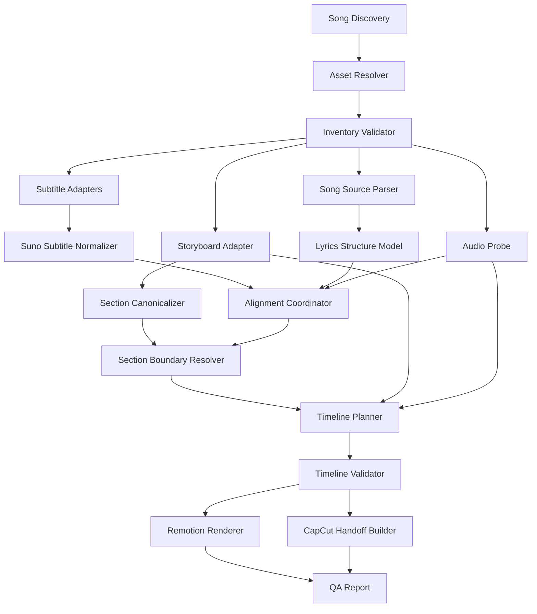

# 다곡 재사용 프로그램 아키텍처 V2

## 1. 문서 지위

이 문서는 `ai-webtoon_capcut` 구현 시 우선 적용하는 재사용 아키텍처 기준이다.

기존 문서는 배경, 품질 원칙, Suno 사례 연구로 유지한다. 구현 구조와 데이터 계약이 충돌하면 이 문서와 `10_DATA_CONTRACTS_V2.md`를 우선한다.

## 2. 재설계 결론

기존 개념 설계는 다곡 처리를 목표로 했지만 UPGRADE 준비 과정에서는 다음 값이 수동으로 지정되었다.

- 곡 이름과 절대 경로
- 42개 패널 고정 검사
- 섹션별 패널 번호 범위
- 섹션 시작·종료 시각
- Bridge 이미지 3회 반복
- 특정 cue 번호와 특정 타임코드 보정

이 방식은 다른 곡에 재사용할 수 없다.

재사용 프로그램에서는 다음을 모두 실행 시점 데이터로 계산해야 한다.

```text
곡 폴더
-> 자산 자동 탐색
-> 패널 번호 기반 매칭
-> 곡 구조와 가사 정규화
-> 섹션 경계 추론
-> 섹션별 이미지 배분
-> 부족·과다 정책 적용
-> 타임라인 생성
-> 자막·렌더·검수 패키지 생성
```

## 3. 조사된 실제 데이터 범위

2026-06-06 로컬 `ai-webtoon/output` 기준:

- 스토리보드 곡: 214개
- 패널 수 범위: 20~63장
- 평균 패널 수: 약 34.27장
- 실제 이미지·음악·LRC/SRT가 모두 있는 곡: 현재 UPGRADE

발견된 섹션 라벨:

```text
Intro
Verse, Verse 1~5
Pre-Chorus
Chorus, Chorus 1~4
Final Chorus
Post-Chorus
Bridge
Hook
Drop
Build
Breakdown
Interlude
Instrumental
Outro
```

패널 타입:

```text
wide, medium, closeup, detail, crowd, silhouette, atmosphere
```

프로그램은 42장, 8개 섹션, 특정 곡 구조를 가정해서는 안 된다.

## 4. 목표

### 핵심 목표

곡마다 다음 값이 달라도 동일 명령으로 처리한다.

- 곡 제목과 폴더명
- 패널 수와 패널 타입
- 이미지 확장자와 해상도
- 음악 형식과 길이
- LRC/SRT 존재 여부와 품질
- 섹션 종류와 반복 횟수
- Intro, 간주, 솔로, Outro 길이
- Remix, Extend, Replace Section 여부

### 완료 산출물

```text
workspace/{song_id}/{run_id}/
├── manifest.json
├── inventory.json
├── subtitles/
├── timeline/
├── render/
├── handoff/
└── reports/
```

원본 곡 폴더에는 기본적으로 아무것도 쓰지 않는다.

## 5. 핵심 설계 원칙

1. **곡별 하드코딩 금지**
   - 곡명, 패널 번호 범위, 시간 경계, 반복 횟수를 코드에 넣지 않는다.

2. **탐색과 판단 분리**
   - 파일을 찾는 단계와 어떤 파일을 선택할지 판단하는 단계를 분리한다.

3. **신뢰도 기반 추론**
   - 섹션 경계와 자막 보정은 근거, 전략, 신뢰도를 함께 기록한다.

4. **정책 주입**
   - 컷 길이, 이미지 반복, 자막 표시, 화면 비율은 설정 프로필로 바꾼다.

5. **결정론**
   - 같은 입력 해시와 설정은 같은 manifest와 timeline을 생성한다.

6. **원본 불변**
   - 원본 이미지, 음악, LRC/SRT, Markdown을 수정하거나 이동하지 않는다.

7. **단계별 중단 가능**
   - inspect, normalize, plan, render, package를 독립 실행할 수 있다.

8. **검수 가능한 자동화**
   - 자동 보정 전후와 제외·반복 이유를 사람이 확인할 수 있어야 한다.

## 6. 전체 아키텍처



## 7. 모듈 경계

```text
src/webtoon_capcut/
├── cli.py
├── application/
│   ├── inspect_song.py
│   ├── normalize_song.py
│   ├── plan_song.py
│   ├── render_song.py
│   ├── package_song.py
│   └── batch_build.py
├── domain/
│   ├── models.py
│   ├── enums.py
│   ├── policies.py
│   └── errors.py
├── discovery/
│   ├── song_discovery.py
│   ├── asset_resolver.py
│   └── candidate_scoring.py
├── adapters/
│   ├── storyboard_markdown.py
│   ├── song_source_txt.py
│   ├── lrc.py
│   ├── srt.py
│   ├── audio_probe.py
│   └── image_probe.py
├── subtitles/
│   ├── classifier.py
│   ├── suno_normalizer.py
│   ├── sequence_matcher.py
│   ├── alignment.py
│   └── exporters.py
├── sections/
│   ├── canonicalizer.py
│   ├── boundary_resolver.py
│   └── confidence.py
├── timeline/
│   ├── allocator.py
│   ├── duration_policy.py
│   ├── reuse_policy.py
│   ├── motion_policy.py
│   └── validator.py
├── rendering/
│   ├── remotion_bridge.py
│   └── process_runner.py
├── packaging/
│   ├── capcut_handoff.py
│   └── reports.py
└── infrastructure/
    ├── config_loader.py
    ├── hashing.py
    ├── paths.py
    └── logging.py
```

## 8. 곡 탐색

### 지원 입력 방식

```powershell
# 한 곡 폴더 직접 지정
webtoon-capcut inspect --song-dir "...\output\UPGRADE"

# output 루트와 곡명
webtoon-capcut inspect --output-root "...\output" --song "UPGRADE"

# 준비된 곡 전체 탐색
webtoon-capcut discover --output-root "...\output"
```

### 준비 상태

| 상태 | 조건 |
|---|---|
| `PROMPTS_ONLY` | 스토리보드와 패널 프롬프트만 있음 |
| `IMAGES_READY` | 스토리보드와 모든 패널 이미지 있음 |
| `MEDIA_READY` | 이미지와 음악 있음 |
| `SUBTITLE_READY` | LRC 또는 SRT 있음 |
| `BUILD_READY` | 이미지, 음악, 스토리보드가 유효함 |
| `REVIEW_REQUIRED` | 처리 가능하지만 자막·섹션 검수 필요 |
| `BLOCKED` | 필수 파일 누락 또는 충돌 |

배치 모드는 `BUILD_READY` 이상만 처리한다. 나머지는 이유를 보고서에 남기고 건너뛴다.

## 9. 자산 탐색과 선택

### 스토리보드

기본 파일명은 `01_storyboard.md`다. 여러 후보가 있으면 자동 선택하지 않는다.

### 이미지

탐색 폴더 후보:

```text
img/
images/
generated/
generated/images/
```

지원 확장자:

```text
.png, .jpg, .jpeg, .webp
```

매칭 키는 파일명의 `panel_NNN`이다. 나머지 문자열은 설명용이며 계약의 핵심이 아니다.

동일 패널 번호 후보가 여러 개면:

1. 사용자 manifest의 명시 경로
2. 설정된 확장자 우선순위
3. 해상도와 수정일을 후보 정보로 표시
4. 자동 확정하지 않고 `AMBIGUOUS_IMAGE`로 중단

### 음악

지원 확장자:

```text
.wav, .flac, .mp3, .m4a
```

선택 우선순위:

1. manifest의 명시 경로
2. 곡 폴더 루트에서 제목과 동일한 stem
3. 곡 폴더 루트의 유일한 음악 파일
4. 그 외에는 중단

### LRC/SRT

둘 다 있으면 둘 다 파싱하고 비교한다. 한쪽을 무조건 우선하지 않는다.

- 시간 품질
- 실제 가사 일치도
- cue 역전·중복·초과
- Suno 프롬프트 블록 여부

를 점수화하여 기본 후보를 정하고 선택 이유를 기록한다.

## 10. 섹션 정규화

원래 라벨을 보존하면서 canonical type을 만든다.

| 원래 라벨 예 | canonical type |
|---|---|
| Verse, Verse 1~5 | `verse` |
| Chorus, Chorus 1~4, Final Chorus | `chorus` |
| Pre-Chorus | `pre_chorus` |
| Post-Chorus | `post_chorus` |
| Hook | `hook` |
| Drop | `drop` |
| Build | `build` |
| Bridge | `bridge` |
| Breakdown | `breakdown` |
| Interlude, Instrumental | `instrumental` |
| Intro | `intro` |
| Outro | `outro` |

알 수 없는 라벨은 삭제하지 않고 `other`로 보존하며 검수 대상으로 표시한다.

## 11. 섹션 경계 해결 전략

경계는 다음 우선순위로 결정한다.

### Level 1: 명시적 sidecar

사용자가 제공한 `section_timing.json`이 스키마 검증을 통과하면 최우선 사용한다.

### Level 2: 신뢰 가능한 timed section cue

프롬프트 블록이 아닌 실제 시간대의 `[Chorus]` 같은 태그를 사용한다.

### Level 3: 원본 곡 TXT와 정리 가사의 시퀀스 정렬

`ai-webtoon/input/{곡명}.txt`의 섹션별 가사와 cleaned cue를 정규화하여 순서 기반으로 매칭한다.

```text
원본 섹션 가사
-> 줄 정규화
-> cleaned subtitle text 정규화
-> 동적 계획법으로 반복·생략 허용 매칭
-> 각 섹션의 첫/마지막 매칭 cue
-> 경계 후보와 신뢰도 생성
```

### Level 4: 스토리보드 가중치 배분

가사 정렬이 불가능하면 스토리보드 패널 수와 권장 시간 비율로 음악 전체를 배분한다.

### Level 5: 균등 폴백

섹션 정보도 없으면 이미지 전체를 음악 길이에 균등 배치한다. 상태는 반드시 `REVIEW_REQUIRED`다.

각 section에는 다음이 기록된다.

```json
{
  "boundary_source": "lyrics_alignment",
  "confidence": 0.87,
  "review_required": false
}
```

## 12. 타임라인 할당

### 기본 컷 길이

프로필 기본값:

```yaml
min_clip_seconds: 2.5
preferred_min_seconds: 4.0
preferred_max_seconds: 8.0
hard_max_seconds: 12.0
```

### 섹션별 처리

1. 섹션 실제 길이를 계산한다.
2. 스토리보드 순서대로 해당 섹션 패널을 가져온다.
3. 권장 시간을 가중치로 섹션 길이를 분배한다.
4. 최소 길이보다 짧으면 낮은 우선순위 패널 제외 후보를 만든다.
5. 최대 길이보다 길면 패널 재사용 또는 모션 분할을 적용한다.
6. 반복·제외 횟수와 이유를 기록한다.

### 재사용 횟수 자동 계산

```text
필요 클립 수 = ceil(섹션 길이 / 목표 최대 컷 길이)
반복 횟수 = ceil(필요 클립 수 / 섹션 이미지 수)
```

반복 횟수는 설정된 최대값을 넘지 않는다. 넘으면 `INSUFFICIENT_IMAGES` 경고를 내고 추가 이미지 생성을 권고한다.

### 이미지 과다

모든 이미지를 사용했을 때 최소 컷 길이보다 짧다면:

1. 패널 타입 다양성 유지
2. 스토리보드 순서 유지
3. 같은 타입의 연속 중복 최소화
4. 섹션 첫·마지막 패널 보존

조건으로 제외 후보를 선택한다.

## 13. 모션 정책

모션은 곡명이나 패널 번호가 아니라 패널 타입과 재사용 index로 결정한다.

```yaml
wide: [slow_zoom_in, slow_pan_left, slow_pan_right]
closeup: [slow_zoom_in, subtle_drift]
silhouette: [slow_zoom_out, slow_pan_right]
medium: [slow_pan_right, slow_zoom_in]
detail: [slow_zoom_in, slow_pan_left]
crowd: [slow_zoom_out, slow_pan_right]
atmosphere: [slow_pan_left, slow_pan_right, slow_zoom_in]
```

이미지의 실제 종횡비를 검사하고 `cover`, `contain`, `smart_crop` 정책을 설정으로 선택한다.

## 14. 자막 정책

`08_SUNO_SUBTITLE_NORMALIZATION.md`의 분류 규칙을 일반화해 적용한다.

- 초반 고밀도 프롬프트 블록은 다중 근거로 탐지
- 대괄호는 의미 분류 후 metadata로 이동
- 긴 cue는 고정 길이로 임의 절단하지 않고 후보 종료 시각을 생성
- 정확한 보컬 종료를 모르면 원본 cue를 별도 보존하고 `HOLD`
- 최종 출력은 `cleaned.srt`, `metadata.json`, `review.csv`

강제 정렬 기능이 꺼져 있을 때는 “정리됨”과 “실제 음원에 재정렬됨”을 구분한다.

```text
NORMALIZED: 구조·메타데이터만 정리
ALIGNED: 최종 음원을 기준으로 시간 재정렬
HUMAN_APPROVED: 사람이 검수 완료
```

## 15. 배치 처리

```powershell
webtoon-capcut discover --output-root "...\ai-webtoon\output"
webtoon-capcut build-all --output-root "...\ai-webtoon\output" --ready-only
```

배치 실행은 곡별 격리된 run 폴더를 사용한다.

- 한 곡 실패가 다른 곡을 중단하지 않음
- 최종 요약에 PASS, REVIEW, SKIP, FAIL 수 기록
- 실패한 곡만 재실행 가능
- 동시 렌더 수와 CPU/GPU 사용량 제한

## 16. 사용자 인터페이스 범위

MVP는 CLI로 고정한다.

웹 UI는 다음 조건 이후에만 추가한다.

- 최소 5곡 end-to-end 검증
- 설정 스키마 안정화
- 오류 코드와 검수 상태 안정화

CLI 우선 결정은 구현 범위를 줄이고 자동 테스트 가능성을 높이기 위한 것이다.

## 17. 비목표

- 이미지 생성
- AI 영상 생성
- CapCut 비공개 포맷 직접 수정
- 모든 저신뢰 자막 자동 승인
- 곡별 커스텀 코드를 소스에 추가하는 방식
- 실제 미디어가 없는 213곡을 준비 완료로 표시하는 것

